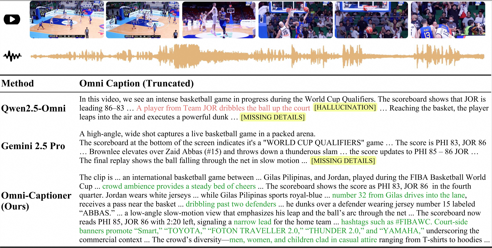
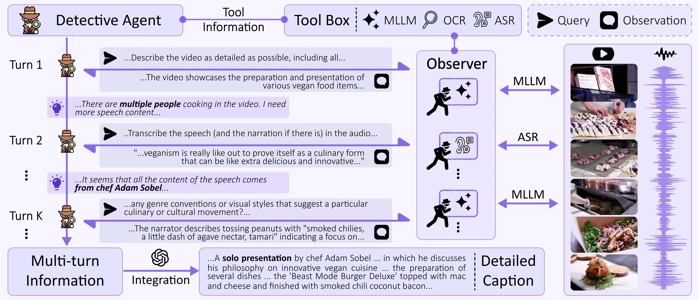
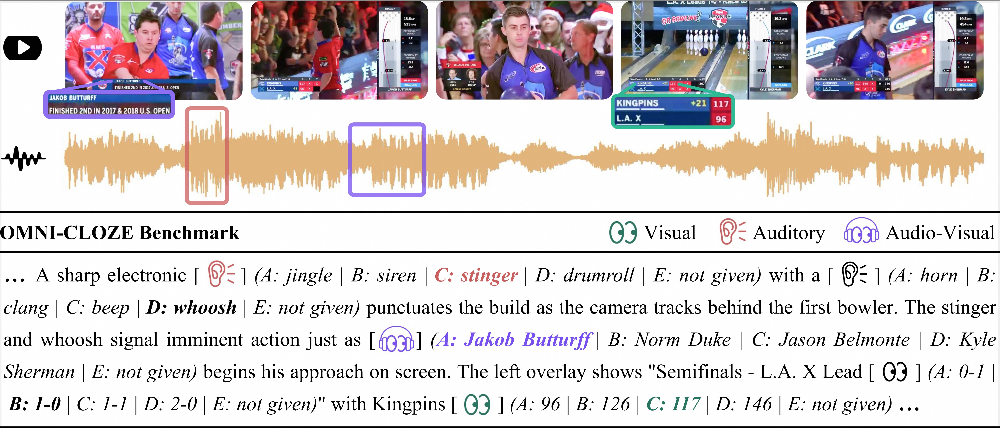

# Omni-Captioner: Data Pipeline, Models, and Benchmark for Omni Detailed Perception
[**📖 arXiv**](https://arxiv.org/abs/2510.12720) | [**🤗 HuggingFace Demo**](https://huggingface.co/spaces/Qwen/Qwen3-Omni-Captioner-Demo) | [**🤖 ModelScope Demo**](https://modelscope.cn/studios/Qwen/Qwen3-Omni-Captioner-Demo) | [**🔧 Qwen3-Omni-Captioner**](https://github.com/QwenLM/Qwen3-Omni/blob/main/cookbooks/omni_captioner.ipynb) | [**🕵️ Omni-Detective Pipeline**](Omni-Detective/main.py) | [**🧑‍🏫 Omni-Cloze Benchmark**]()


# News
- [2025.10.17] [**A minimal, extensible implementation**](Omni-Detective/main.py) of the Omni‑Detective agentic data pipeline has been released. 
- [2025.10.14] Omni-Captioner techinical report has been release on [**arXiv**](https://arxiv.org/abs/2510.12720). 
- [2025.09.22] Qwen3-Omni-Captioner has been released. Check out [**HuggingFace Demo**](https://huggingface.co/spaces/Qwen/Qwen3-Omni-Captioner-Demo) and [**ModelScope Demo**](https://modelscope.cn/studios/Qwen/Qwen3-Omni-Captioner-Demo), and refer to the [**cookbook**](https://github.com/QwenLM/Qwen3-Omni/blob/main/cookbooks/omni_captioner.ipynb) for usage. 

# Contents
- [Overview](#overview)
- [Agentic Data Generation: Omni-Detective](#agentic-data-generation-omni-detective)
  - [Guides](#guides)
  - [Quick Start](#quick-start)
- [Omni Detailed Captioning Model: Omni-Captioner](#agentic-data-generation-omni-detective)
  - [Guides](#guides)
  - [Quick Start](#quick-start)
- [Omni Detailed Captioning Benchmark: Omni-Cloze](#omni-detailed-captioning-benchmark-omni-cloze)
  - [Guides](#guides)
  - [Quick Start](#quick-start)
- [Citation](#citation)

# Overview
Fine-grained perception of multimodal information is critical for advancing human–AI interaction. **Omni‑Captioner** is a multimodal large language model capable of producing highly detailed, low-hallucination audio‑visual captions. We have released the audio version, Qwen3‑Omni‑Captioner, and the audio‑video version will follow. We also propose **Omni-Detective** for data generation and **Omni-Cloze** for evaluation omni detailed captioning. 



# Agentic Data Generation: Omni-Detective

## Guides
**Omni‑Detective** is an agentic data generation framework that leverages iterative **Query-Observation** cycles to autonomously extract and synthesize richly detailed, and minimally hallucinatory audio–visual annotations. Omni-Detective is composed of three key components:
1. A **Detective Agent** that spontaneously orchestrates the perception process;
2. A **Tool Box** containing multiple tools for extracting information from multimodal data;
3. Independent **Observers** that interact with raw audio-video streams to probe targeted aspects.



## Quick Start
We provide a minimal, extensible implementation only contains an audio language model (Qwen3-Omni-flash) in the tool box. You can extend it with additional tools and designs. 
```bash
cd Omni-Detective
python main.py \
  --input_path ./data/input.jsonl \
  --output_path ./data/output.jsonl \
  --num_workers 3
```

# Omni Detailed Captioning Model: Omni-Captioner

## Guides
Leveraging the high-fidelity multimodal detailed captioning data produced by Omni-Detective, we train Audio-Captioner and Omni-Captioner with a two-stage curriculum over the audio and audio–visual modalities. We have released the audio version, Qwen3‑Omni‑Captioner, and the audio‑video version will follow.

## Quick Start
Refer to the [**cookbook**](https://github.com/QwenLM/Qwen3-Omni/blob/main/cookbooks/omni_captioner.ipynb) for usage. Check out [**HuggingFace Demo**](https://huggingface.co/spaces/Qwen/Qwen3-Omni-Captioner-Demo) and [**ModelScope Demo**](https://modelscope.cn/studios/Qwen/Qwen3-Omni-Captioner-Demo) for Live Demo. 

Note: **Qwen3-Omni-30B-A3B-Captioner** is a single-turn model that accepts only one audio input per inference. It does not accept any text prompts and supports **audio input only**, with **text output only**. As Qwen3-Omni-30B-A3B-Captioner is designed for generating fine‑grained descriptions of audio, excessively long audio clips may diminish detail perception. We recommend, as a best practice, limiting audio length to no more than 30 seconds.

# Omni Detailed Captioning Benchmark: Omni-Cloze

## Guides

**Omni-Cloze** frames detailed captioning evaluation as a **cloze-style multiple-choice proxy task**. Omni-Cloze is a unified benchmark for evaluating detailed captioning across audio-only, visual-only, and audio–visual settings. The dataset spans 9 main domains and 47 sub-categories  covering diverse topics such as education, entertainment, sports, news, science, and lifestyle, with a total of 2k video clips with 70k fine-grained cloze blanks.



## Quick Start (TODO)
We will open‑source the Omni‑Cloze benchmark as soon as possible. 

# Citation
If you find our data pipeline, models, or the benchmark useful, please consider giving a star and a citation, thanks!
```
@article{ma2025omni,
  title={Omni-Captioner: Data Pipeline, Models, and Benchmark for Omni Detailed Perception},
  author={Ma, Ziyang and Xu, Ruiyang and Xing, Zhenghao and Chu, Yunfei and Wang, Yuxuan and He, Jinzheng and Xu, Jin and Heng, Pheng-Ann and Yu, Kai and Lin, Junyang and others},
  journal={arXiv preprint arXiv:2510.12720},
  year={2025}
}
```